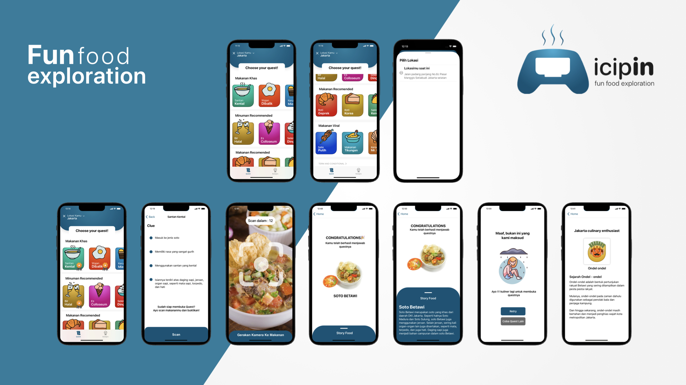

<div id="top"></div>

[![Contributors][contributors-shield]][contributors-url]
[![Forks][forks-shield]][forks-url]
[![Stargazers][stars-shield]][stars-url]
[![Issues][issues-shield]][issues-url]
[![MIT License][license-shield]][license-url]
[![LinkedIn][linkedin-shield]][linkedin-url]


<!-- PROJECT LOGO -->
<br />
<div align="center">
  <h3 align="center">Icipin</h3>
  </br>
</div>

<!-- TABLE OF CONTENTS -->
<details>
  <summary>Table of Contents</summary>
  <ol>
    <li>
      <a href="#about-the-project">About The Project</a>
      <ul>
        <li><a href="#built-with">Built With</a></li>
      </ul>
    </li>
    <li>
      <a href="#getting-started">Getting Started</a>
      <ul>
        <li><a href="#prerequisites">Prerequisites</a></li>
        <li><a href="#installation">Installation</a></li>
      </ul>
    </li>
    <li><a href="#contributing">Contributing</a></li>
    <li><a href="#contact">Contact</a></li>
    <li><a href="#acknowledgments">Acknowledgments</a></li>
  </ol>
</details>


<!-- ABOUT THE PROJECT -->
## About The Project

<p align="middle">
   
</p>

Icipin is a gaming apps that encourages tourists to explore culinary tourism by completing quests. In Indonesia, there is 5.300 traditional food across island and city, and sometimes make people confused about how to start their journey as a food explorer. When you use Icipin, you can explore many food in Indonesia as fun as you playing a game!, and not only that, you also can track your journey and collect all the badges after completing the quests.


### Built With

This apps built with

* [XCode](https://developer.apple.com/xcode/)
* [Swift](https://developer.apple.com/swift/)
* [SwiftUI](https://developer.apple.com/xcode/swiftui/)
* [CoreData](https://developer.apple.com/documentation/coredata)
* [CoreML](https://developer.apple.com/documentation/coreml)
* [CreateML](https://developer.apple.com/documentation/createml)

<p align="right">(<a href="#top">back to top</a>)</p>


<!-- GETTING STARTED -->
## Getting Started

To copy this project, you must have XCode to open and build copy of the project cloned via github

### Prerequisites

Clone repository using git
* git
  ```sh
  git clone https://github.com/rivaldofez/Icipin.git
  ```

### Installation

Installation steps

1. Download and setup your XCode from AppStore
2. Load the project and build

<p align="right">(<a href="#top">back to top</a>)</p>


<!-- CONTRIBUTING -->
## Contributing

Contributions are things that make the open source community be an amazing place to learn, invent, and create new technologies. Any contributions you make are **greatly appreciated**.

If you have a suggestion that would make this better, please fork the repo and create a pull request. You can also simply open an issue with the tag "improvement".

1. Fork the Project
2. Create your Feature Branch (`git checkout -b feature/ImprovementFeature`)
3. Commit your Changes (`git commit -m 'Add some ImprovementFeature'`)
4. Push to the Branch (`git push origin feature/ImprovementFeature`)
5. Open a Pull Request

<p align="right">(<a href="#top">back to top</a>)</p>


<!-- CONTACT -->
## Contact Our Team

* Rivaldo Fernandes
* Mohammad Irvan
* Viviola Putri
* Hisyam Sanusi
* Pieter Natanael

Project Link: [https://github.com/rivaldofez/Icipin](https://github.com/rivaldofez/Icipin)

<p align="right">(<a href="#top">back to top</a>)</p>


<!-- ACKNOWLEDGMENTS -->
## Acknowledgments

This apps in one of my project during Apple Developer Academy

<!-- MARKDOWN LINKS & IMAGES -->
<!-- https://www.markdownguide.org/basic-syntax/#reference-style-links -->
[contributors-shield]: https://img.shields.io/github/contributors/rivaldofez/Icipin.svg?style=for-the-badge

[contributors-url]: https://github.com/rivaldofez/Icipin/graphs/contributors

[forks-shield]: https://img.shields.io/github/forks/rivaldofez/Icipin.svg?style=for-the-badge

[forks-url]: https://github.com/rivaldofez/Icipin/network/members

[stars-shield]: https://img.shields.io/github/stars/rivaldofez/Icipin.svg?style=for-the-badge

[stars-url]: https://github.com/othneildrew/Best-README-Template/stargazers

[issues-shield]: https://img.shields.io/github/issues/othneildrew/Best-README-Template.svg?style=for-the-badge

[issues-url]: https://github.com/rivaldofez/Icipin/issues

[license-shield]: https://img.shields.io/github/license/rivaldofez/Icipin.svg?style=for-the-badge

[license-url]: https://github.com/rivaldofez/Icipin/blob/master/LICENSE.txt

[linkedin-shield]: https://img.shields.io/badge/-LinkedIn-black.svg?style=for-the-badge&logo=linkedin&colorB=555

[linkedin-url]: https://www.linkedin.com/in/rivaldofez